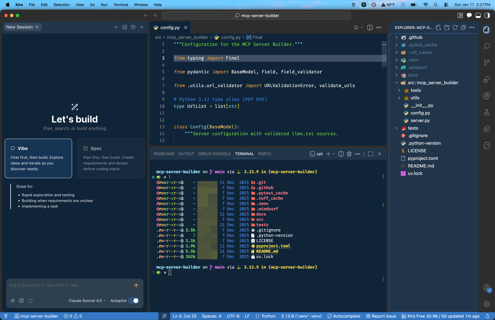
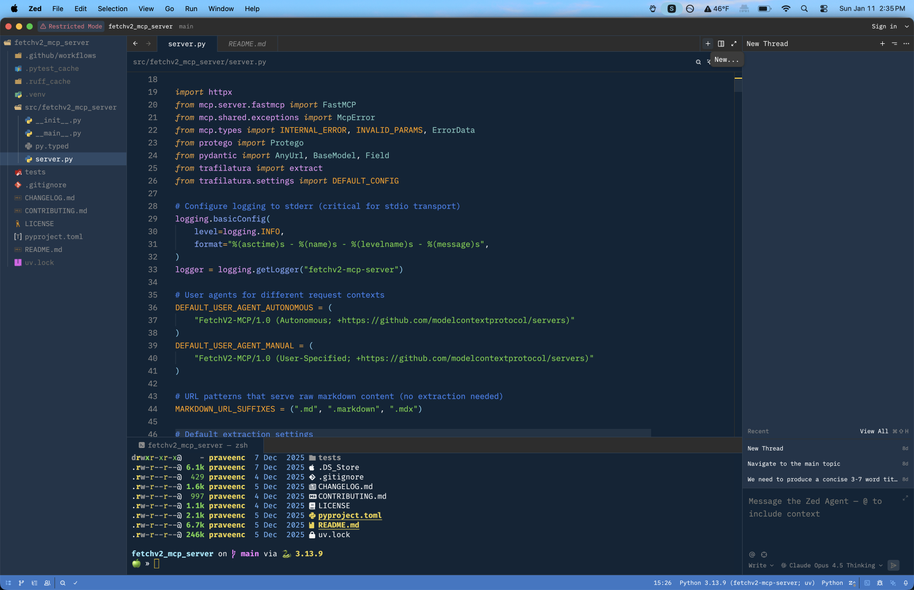
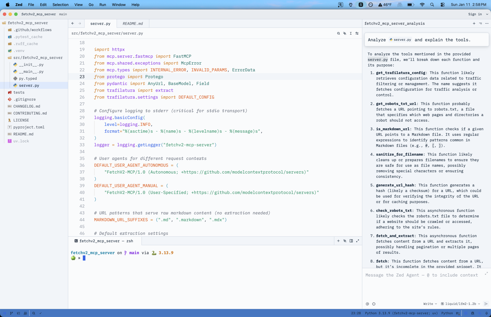
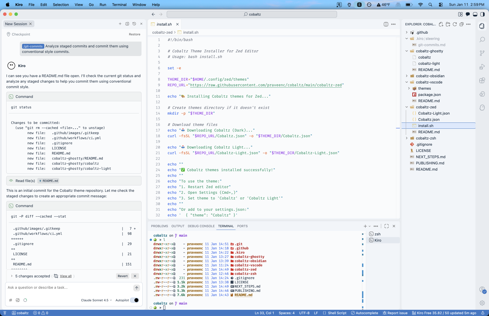

# Cobaltz Theme

A refined dark theme inspired by Cobalt2, featuring deep blue tones, vibrant syntax highlighting, and a signature golden cursor. Available for multiple editors and terminals.



## Features

- Deep blue background (`#0F2438`) that's easy on the eyes
- Vibrant, carefully chosen syntax colors
- Signature golden cursor (`#FFCC00`)
- Blue status bar accent (`#3478C6`)
- Both dark and light variants
- Consistent experience across all supported platforms

## Supported Platforms

| Platform | Dark | Light | Installation |
| -------- | ---- | ----- | ------------ |
| [Zed](./cobaltz-zed/) | ✅ | ✅ | [Instructions](#zed) |
| [VS Code / Cursor / Kiro](./cobaltz-vscode/) | ✅ | ✅ | [Instructions](#vs-code) |
| [Obsidian](./cobaltz-obsidian/) | ✅ | ✅ | [Instructions](#obsidian) |
| [Ghostty](./cobaltz-ghostty/) | ✅ | ✅ | [Instructions](#ghostty) |
| [iTerm2 / Zsh](./cobaltz-zsh/) | ✅ | - | [Instructions](#iterm2--zsh) |

## Color Palette

### Dark Theme

| Element | Color | Preview |
| ------- | ----- | ------- |
| Background | `#0F2438` |  |
| Foreground | `#FFFFFF` |  |
| Cursor | `#FFCC00` |  |
| Keywords | `#F1A23A` |  |
| Functions | `#82AAFF` |  |
| Strings | `#6FD640` |  |
| Variables | `#ED99FA` |  |
| Comments | `#3B86F7` |  |
| Types | `#80CBC4` |  |
| Numbers | `#EA79A3` |  |

### Light Theme

| Element | Color | Preview |
| ------- | ----- | ------- |
| Background | `#FAFBFC` |  |
| Foreground | `#0F2438` |  |
| Cursor | `#2563EB` |  |
| Keywords | `#D97706` |  |
| Functions | `#2563EB` |  |
| Strings | `#059669` |  |
| Variables | `#9333EA` |  |
| Comments | `#6B7280` |  |

## Installation

### Zed

1. Copy `cobaltz-zed/Cobaltz.json` and/or `cobaltz-zed/Cobaltz-Light.json` to `~/.config/zed/themes/`
2. Open Zed Settings and select "Cobaltz" or "Cobaltz Light" as your theme

### VS Code

#### From VSIX (Local Install)

1. Navigate to the `cobaltz-vscode` directory
2. Run `npx vsce package` to create the `.vsix` file
3. In VS Code: `Cmd+Shift+P` → "Install from VSIX" → select the file
4. Select "Cobaltz" or "Cobaltz Light" from Color Theme settings

#### Manual Install

Copy the `cobaltz-vscode` folder to:
- **macOS**: `~/.vscode/extensions/cobaltz-theme`
- **Windows**: `%USERPROFILE%\.vscode\extensions\cobaltz-theme`
- **Linux**: `~/.vscode/extensions/cobaltz-theme`

Works with VS Code forks: Cursor, Windsurf, Kiro, etc.

### Obsidian

1. Copy the `cobaltz-obsidian` folder to your vault's `.obsidian/themes/` directory
2. Rename it to `Cobaltz`
3. Go to Settings → Appearance → Themes → Select "Cobaltz"

The theme automatically switches between dark and light based on your system preference.

### Ghostty

1. Copy theme files to your Ghostty themes directory:
   ```bash
   mkdir -p ~/.config/ghostty/themes
   cp cobaltz-ghostty/cobaltz cobaltz-ghostty/cobaltz-light ~/.config/ghostty/themes/
   ```

2. Add to `~/.config/ghostty/config`:
   ```text
   # Auto-switch based on system appearance
   theme = dark:cobaltz,light:cobaltz-light
   ```

### iTerm2 / Zsh

1. **iTerm2 Colors**: Import `cobaltz-zsh/cobaltz.itermcolors` via Preferences → Profiles → Colors → Color Presets → Import

2. **Zsh Theme**:
   ```bash
   cp cobaltz-zsh/cobaltz.zsh-theme ~/.oh-my-zsh/themes/
   ```
   Then set `ZSH_THEME="cobaltz"` in `~/.zshrc`

3. **Font**: Use a [Powerline-patched font](https://github.com/powerline/fonts) or enable "Use built-in Powerline glyphs" in iTerm2

## Screenshots

### Zed Editor (Dark)


### Zed Editor (Light)


### Kiro Editor (Dark)


### Kiro Editor (Light)


## Contributing

Contributions are welcome! Feel free to:

- Report issues
- Suggest improvements
- Add support for new platforms
- Submit pull requests

## License

MIT License - see [LICENSE](LICENSE) for details.

## Credits

- Inspired by [Cobalt2](https://github.com/wesbos/cobalt2-vscode) by Wes Bos
- Color scheme refinements by Praveen Chamarthi

## Author

**Praveen Chamarthi**

- GitHub: [@praveenc](https://github.com/praveenc)
